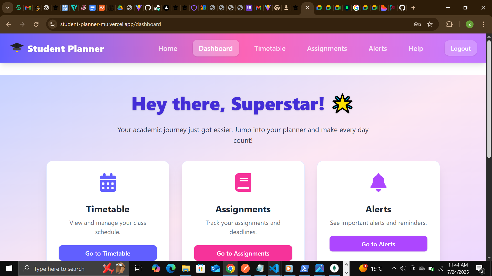
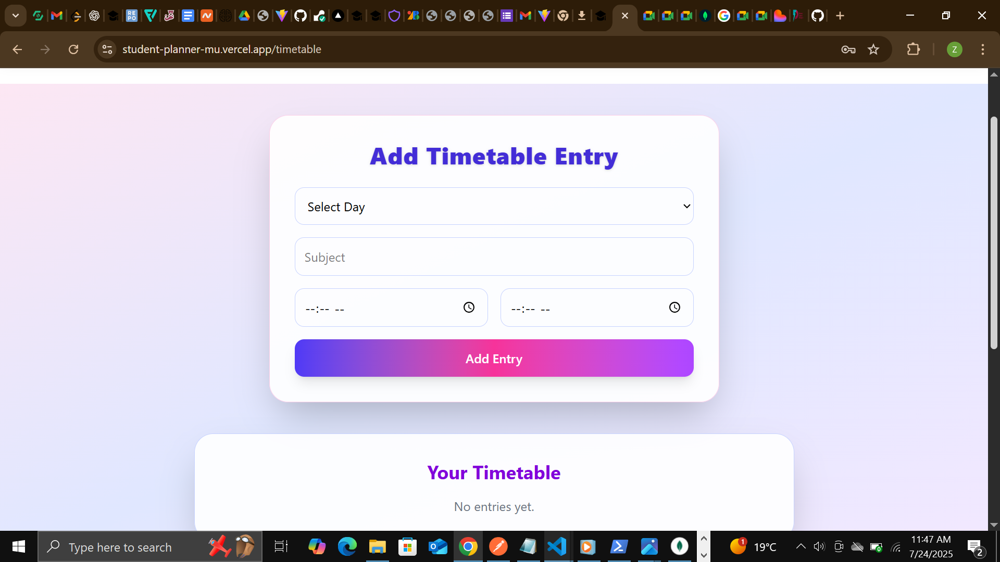
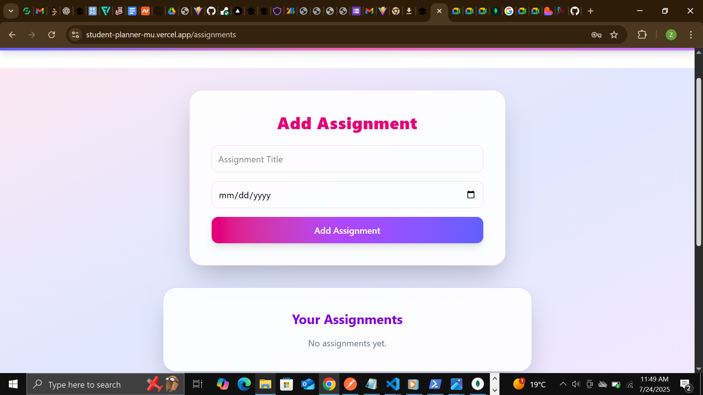
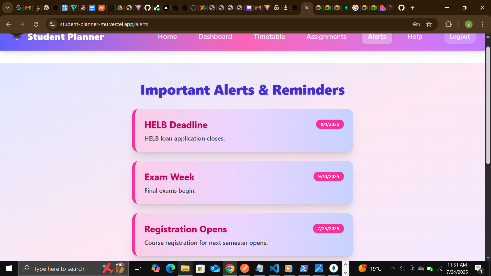

# Student Planner

Student Planner is a full-stack MERN application designed to help students organize their academic life. It provides features like assignment tracking, timetable management, alerts, and a help section, all accessible through a modern, responsive interface.

## Features

- **Dashboard:** Overview of upcoming assignments, alerts, and timetable.
- **Timetable:** Manage and view your weekly schedule.
- **Assignments:** Add, edit, and track assignments.
- **Alerts:** Receive important notifications.
- **Help:** Access resources and support.
- **Authentication:** Secure login and registration.

## Setup Instructions

1. **Clone the repository:**
   ```sh
   git clone https://github.com/zeynab1333/StudentPlanner.git
   cd student-planner
   ```

2. **Install dependencies:**
   - For the client:
     ```sh
     cd client
     pnpm install
     ```
   - For the server:
     ```sh
     cd ../server
     pnpm install
     ```

3. **Configure environment variables:**
   - Copy `.env.example` to `.env` in both `client/` and `server/` folders and update values as needed.

4. **Run the application:**
   - Start the server:
     ```sh
     pnpm run dev
     ```
   - Start the client:
     ```sh
     cd ../client
     pnpm run dev
     ```

5. **Access the app:**
   - Open [http://localhost:5173](http://localhost:5173) in your browser.

## Deployed Application

[Live Demo](https://student-planner-mu.vercel.app/)

## Video Demonstration

[Watch the 5-10 minute demo](https://your-demo-video-link.com)

## Screenshots

### Dashboard


### Timetable


### Assignments


### Alerts


---

For more details, see the [/README.md](/README.md).